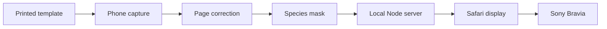

# Jungle Sketchbook Architecture

## Goal

Create the museum moment at home: a child colors a known animal template, takes
a photo, and sees that exact drawing come alive on the television within a few
seconds.

The important constraint is that the system controls the printed template. It
does not need to identify or animate an arbitrary drawing. Each species has a
known page layout, silhouette, texture mapping, and animation rig. That turns a
difficult generative-vision problem into a deterministic image-processing and
rendering pipeline.

## High-level system



There are three independently replaceable parts:

1. **Capture client** — photographs, rectifies, and extracts the child's artwork.
2. **Local coordinator** — validates submissions, keeps recent scene state, and
   broadcasts new animals.
3. **Display client** — renders the jungle and owns the visual lifecycle of each
   animal.

All three are web-based. The display can run in desktop Chrome, an Android TV
browser, or a small native WebView wrapper without changing the capture pipeline.

## End-to-end data flow

1. A species template is printed with a fixed outline and four corner markers.
2. The child colors inside the animal.
3. The capture client obtains a photo from a phone camera or photo library.
4. V0 asks the user for four page corners. V1 will detect the markers.
5. A homography maps the photographed quadrilateral onto an 840 × 1188 canonical
   page.
6. The known species contour clips the canonical page to a transparent canvas.
7. The cropped PNG is posted with species metadata to `POST /api/animals`.
8. The server assigns an ID and timestamp, stores the recent submission in
   memory, and emits an `animal` event.
9. Every connected display loads the texture and creates a scene object.
10. The object begins in the foreground, ages into smaller/slower lanes, and is
    removed after its final pass.

## Why the V0 plan is technically sound

The V0 deliberately validates the highest-value integration before solving the
polish problems:

- **Registration is deterministic.** Four known corners provide enough data for
  perspective correction; encoded markers can automate the same operation later.
- **Background removal is deterministic.** A fixed species silhouette avoids AI
  segmentation and preserves the child's actual colors and writing.
- **Animation and artwork are separate.** A reusable rig moves the mesh while the
  submitted PNG remains the texture. Runtime generative video would be slower,
  more expensive, inconsistent, and likely to alter the drawing.
- **The network path is simple.** HTTP uploads and Server-Sent Events work well
  for one-way, low-frequency submissions on a home LAN.
- **The TV is only a client.** The server can remain on the old MacBook elsewhere
  in the house; the Bravia needs only to render the display URL.

The main technical risk is not page recognition. It is producing attractive,
reusable 2D animal rigs and walk cycles without losing the flat paper aesthetic.
That work should begin only after automatic capture is reliable.

## Current components

### Capture client

`public/capture.js` uses browser Canvas APIs and no external dependencies. The
pure geometry functions live in `public/geometry.js` so the transform math can
be tested without a browser. Each animal folder contains its printable template
and a matching shape module with silhouette, crop bounds, and display metadata.

- Displays a downscaled copy of the source photo for corner selection.
- Rejects crossed or implausibly small corner quadrilaterals.
- Downscales very large phone photos before pixel processing to limit memory use.
- Solves an 8-variable projective transform using Gaussian elimination.
- Uses inverse mapping and bilinear sampling to produce the canonical page.
- Clips the page with the selected species contour from its printable template.
- Crops the transparent result and sends it as a PNG data URL.

The template, contour, and output dimensions must stay aligned. Focused tests
compare each printable SVG's marked silhouette paths with its shared capture
mask. Adding a species does not duplicate the capture pipeline.

### Local coordinator

`server.js` is intentionally dependency-free.

- Serves the static client files.
- Validates species, content type, and payload size.
- Retains a bounded in-memory list of recent animals.
- Broadcasts additions and clears using Server-Sent Events.
- Sends keepalives so TV/browser connections survive idle periods.
- Restricts static-file resolution to the `public` directory.

This is adequate for one household. Persistence can later use SQLite or a small
on-disk directory containing PNG files plus metadata.

### Display client

`public/display.js` uses the Canvas 2D API for the first milestone.

- Restores recent server state when the page opens.
- Deduplicates animals by server-generated ID.
- Receives new submissions in real time.
- Randomizes direction, speed, and animation phase.
- Assigns scale, speed, and vertical lane based on age.
- Reconnects automatically through the browser's EventSource implementation.

The background uses layered trunks, fronds, colored glows, and fireflies to echo
the gallery's luminous teal-and-purple jungle while keeping submitted drawings
visually dominant. Canvas 2D is enough to validate the experience. A future deformable animal can
use Three.js, PixiJS, or another WebGL renderer while keeping the API unchanged.

## State model

The server is the source of truth for recent submissions. A display owns only
ephemeral visual state such as position, direction, lane, and animation phase.

```text
Server animal
  id
  species
  texture
  createdAt

Display animal
  server fields + image
  x / direction / speed
  age / layer / phase
```

V0 state is intentionally volatile. Restarting the Node process clears the
safari. Persistence should be added before scheduled/kiosk operation.

## Network and deployment

Recommended development configuration:

```text
iPhone capture ──Wi-Fi──► old MacBook server/display ──HDMI──► Bravia
```

Recommended finished configuration:

```text
iPhone/iPad capture ──Wi-Fi──► old MacBook server
                                      │
                                      └──Wi-Fi/Ethernet──► Bravia WebView app
```

The server binds to `0.0.0.0` so other LAN devices can connect. It has no TLS,
login, or authorization and must not be forwarded or exposed to the public
internet.

The Android TV deliverable should be a thin fullscreen WebView that:

- Opens a configured local display URL
- Enables JavaScript and hardware acceleration
- Keeps the screen awake
- Hides navigation and system chrome
- Retries after temporary server/network failures
- Can later discover the server using mDNS

No Play Store publication is needed for a sideloaded household build.

## Recommended implementation sequence

### Milestone 0 — end-to-end proof (complete)

- One lion template
- Manual four-corner registration
- Deterministic silhouette extraction
- Live LAN delivery
- Simple cutout motion and depth aging

Exit criterion: a real colored sheet appears reliably on a second screen.

### Milestone 1 — automatic capture

- Define robust marker IDs for page corner and species
- Detect all four markers in the camera frame
- Reject occluded/ambiguous pages
- Wait for a stable image and auto-capture
- Add white-balance and saturation correction

Exit criterion: hold up a page and see it submitted without tapping corners.

### Milestone 2 — first real animal rig

- Convert the lion silhouette to a deformable mesh
- Define body, head, four legs, and tail bones
- Create a loopable side-view walk cycle
- Preserve the scanned texture during deformation
- Add a foreground arrival moment

Exit criterion: the child's exact lion visibly walks rather than sliding/bobbing.

### Milestone 3 — content expansion (started)

- Add lion, fox, zebra, and gazelle templates, followed by rhino and elephant
- Move species geometry and behavior into data files
- Add per-species scale, speed, lane, and animation settings

Exit criterion: every original safari species can be recognized and animated.

### Milestone 4 — household productization

- Persist drawings and metadata
- Add parent controls and clear/history behavior
- Improve jungle artwork and ambient audio
- Add kiosk startup and server health reporting
- Build and sideload the Android TV WebView client

Exit criterion: turning on the TV and selecting Jungle Sketchbook is enough to
start the experience.

## Deferred decisions

- Canvas 2D vs. Three.js/PixiJS for the articulated renderer
- Custom square markers vs. ArUco/AprilTag detection
- SQLite vs. filesystem persistence
- Manual server URL vs. mDNS discovery
- One shared species rig format vs. renderer-specific assets

These choices do not block V0. They should be evaluated with a working colored
lion and actual Bravia performance rather than decided theoretically.
